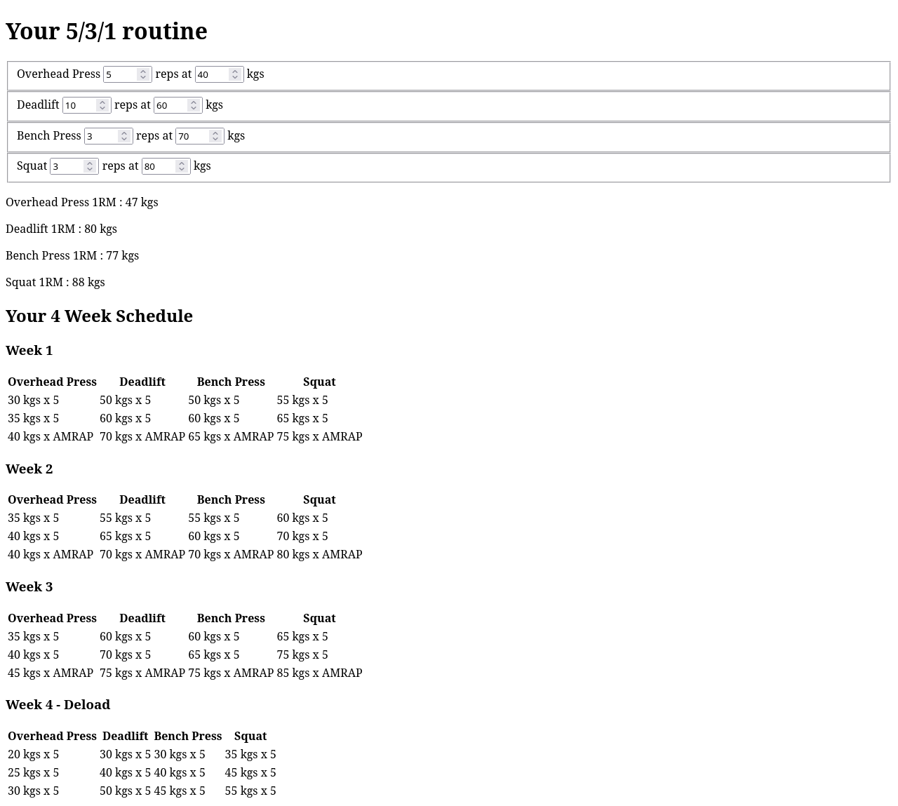

# Three Five One Static Webapp

# Vision

Using technology is easy. Solving problems with technology is extremely hard.

Rather than learning two things at once, I'm learning technology by repeatedly solving the same problem again and again.

The problem is a simple Workout Generator that calculates 1 rep max and is based off the 5/3/1 weightlifting program.

# Roadmap

See [ROADMAP.md](ROADMAP.md)

# Contributing

# Getting started

# Testing

# Deploying
